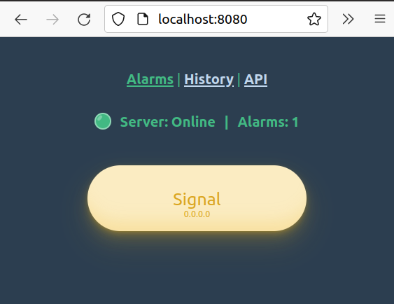
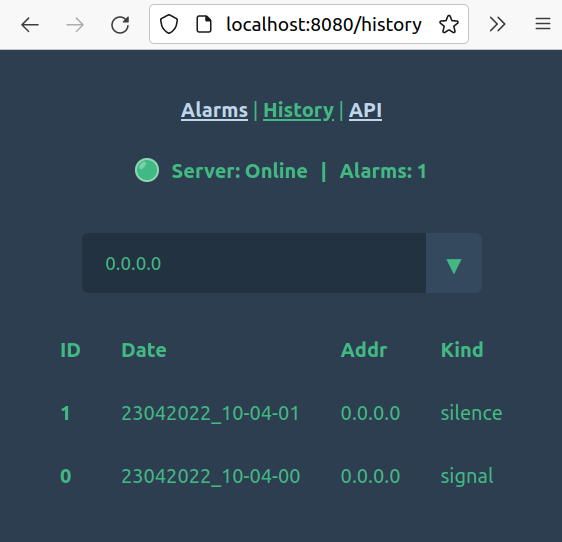

# State
⚠️ **[DEPRECATED] Not being developed anymore. There are plans to port this to Rust as a Cloud-Native application.**

# Lala
A secure front-end application to trigger an alarm on a server, which notifies all clients.

# Screenshots
 \

